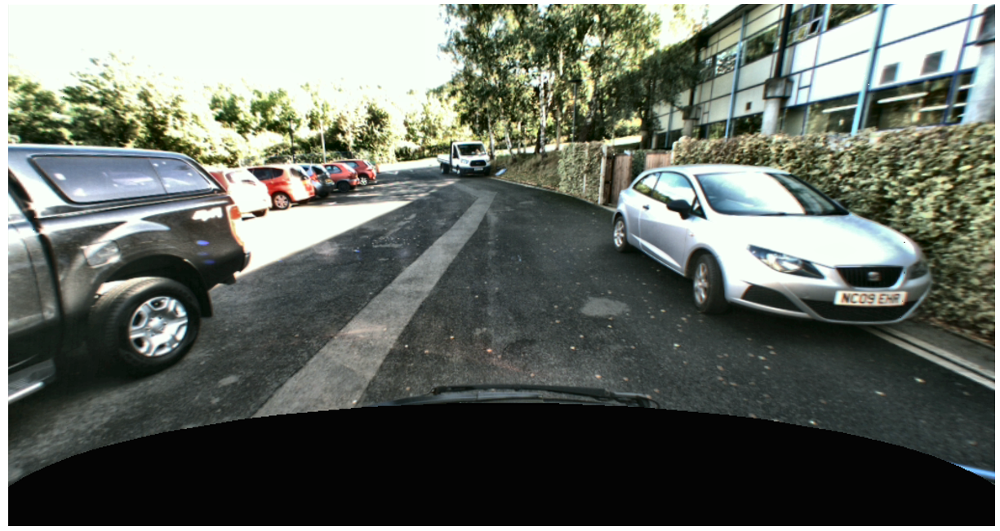
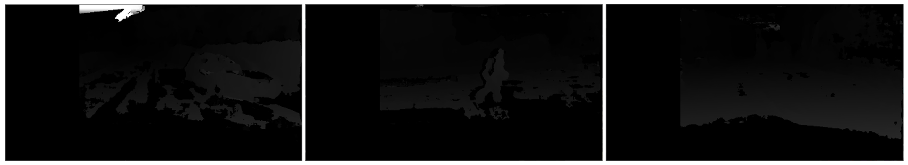
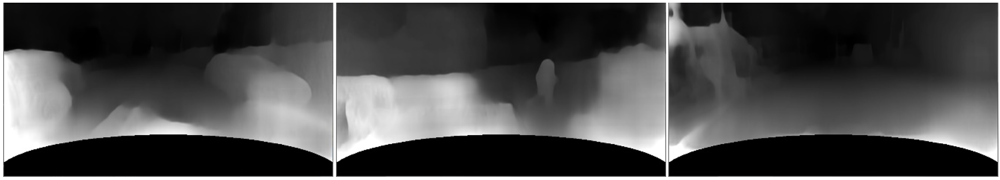
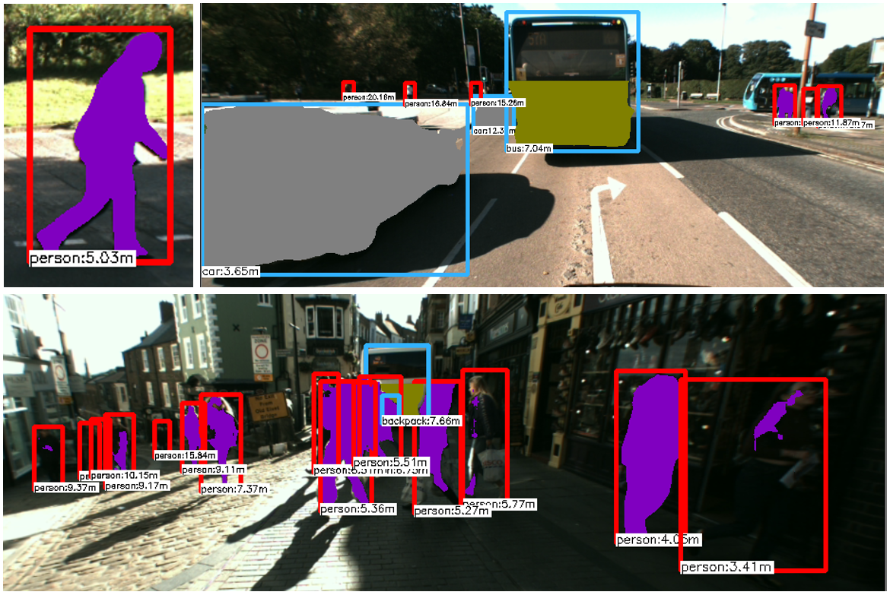

# Computer vision

> What's this?

This repo contains several implementations and details on a submission for computer vision coursework I created during university. 

## Introduction

### What was the brief?

We were tasked with coming up with a solution that could be used to estimate distances of pedestrians within a recorded dataset of images captured from a vehicle driving around in the city. We had to submit a [small report](./submission/report.pdf) on our implementation and findings along with a [video](./submission/video.m4v) which showed each frames distances.

### What was the application?

🧑‍🤝‍🧑 🛑 <--- 👀 🚗

> Autonomous vehicles

### What features make a submission successful?

There were multiple ways to achieve this and the primary method used to evaluate each submission was based on the final distances returned. Some solutions to this problem could lead to rapidly varying distances from frame to frame, which in a real application of autonomous cars would lead to significant issues. As a result, submissions that had an accurate reading of distances across frame to frame but also did not vary greatly from noise were rewarded more.

### Wheres the report?

You can find the report submitted [here](./submission/report.pdf).

## Submission overview

My submission relied on the combination of several machine learning techniques to achieve a more optimal outcome.

## Image manipulation

The dataset we were given were from fixed cameras on a mobile vehicle. The bonnet of the vehicle was visible and due to the weather conditions, reflections were visible on the bonnet. When running object detection algorithms on this dataset, there could therefore be the risk that these networks may detect erroneous objects from these reflections. As a result, one of the implementation details of my submission involved masking out the bonnet of the vehicle.

> The bonnet masked out so object detection algorithms wouldn't incorrectly detect objects in reflections

## Disparity calculation

Several techniques were implemented and trialed for calculating the disparity map. A disparity map can be obtained from a pair of stereo images and can be used for depth calculations.

> The disparity map calculated using the [Hirschmuller OpenCV implementation](https://docs.opencv.org/3.4/d2/d85/classcv_1_1StereoSGBM.html)

> The disparity map calculated using a Monocular depth estimation network ([monodepth2](https://github.com/nianticlabs/monodepth2))

> The disparity map calculated using a Pyramid Stereo Matching Network

### Object detection

For object detection, I utilized the YOLO CNN model to be able to record bounding boxes of subjects of interest. Alongside these bounding boxes, you can also obtain a label for the type of object that has been detected.

## Semantic segmentation

Once a bounding box has been obtained and the disparity map calculated, you can in theory use both of them to calculate distances. One such way is to average the distance obtained from across the entire bounding area.

This solution has issues however as by their definition, bounding boxes do not conform to the shape of many objects and therefore when computing distances you may be using distance values that are very different to the actual subject of interest.

To improve this method, a semantic segmentation network was executed on the constrained bounding box region. This meant that distances could be used more often from the subject rather than from background distance values.

> An example of a segmentation returned from the segmentation network

## Further suggestions

In my report, I detailed some further explorations I would consider looking into if I had more time. These included trialing the implementation in various weather conditions (e.g. snow) to see greatly it affects the accuracy of distances returned.

Finally another one of these suggestions was to use [Generative Adversarial Networks](https://arxiv.org/abs/1406.2661) to reduce the effect of motion blur when the vehicle is moving fast. An example of such a model available in the public domain at the time was [DeblurGANV2](https://github.com/Dou-Yu-xuan/DeblurGANv2).
